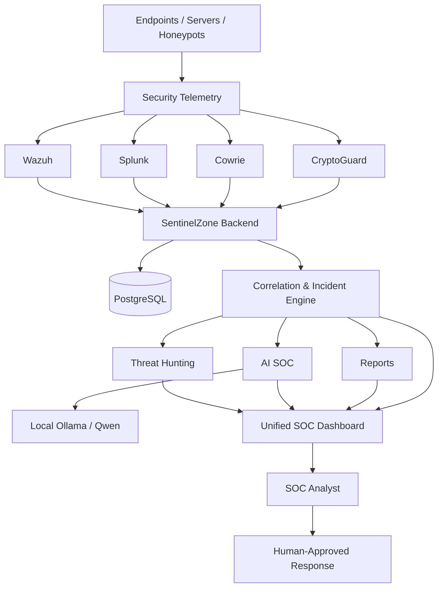

# SentinelZone SOC Platform

<p align="center">
  <strong>Unified Security Operations, Detection Engineering, Hardware-Aware Telemetry, and AI-Assisted Investigation</strong>
</p>

<p align="center">
  
  
  
  
  
  
  
</p>

<p align="center">
  <a href="https://sentinel-zone-soc-platform.vercel.app/"><strong>Live Dashboard</strong></a>
  ·
  <a href="https://github.com/Ulvu11/SentinelZone-SOC-Platform"><strong>GitHub Repository</strong></a>
</p>

---

## Overview

**SentinelZone** is an enterprise-oriented Security Operations Center platform built to bring security telemetry, incident management, endpoint visibility, honeypot intelligence, hardware-aware monitoring, threat hunting, reporting, and AI-assisted investigation into one unified analyst workspace.

The project follows an evidence-first SOC workflow:

```text
Telemetry
   ↓
Normalized Security Events
   ↓
Correlation
   ↓
Incidents
   ↓
Evidence & Timeline
   ↓
Analyst Investigation
   ↓
AI-Assisted Analysis
   ↓
Human-Approved Response
```

SentinelZone is developed and tested in an isolated cybersecurity lab environment.

---

## Key Capabilities

### Unified SOC Dashboard

The web interface provides a centralized analyst view for:

- SOC overview and security telemetry
- Alerts and incident management
- Endpoint inventory and health
- Hardware / CryptoGuard monitoring
- Network security observations
- Identity-related events
- Cowrie honeypot activity
- Threat hunting
- AI-assisted investigation
- Security reporting
- Integration and workspace settings

### Incident Management

SentinelZone persists and correlates security observations into analyst-ready incidents.

Incidents can include:

- Incident ID
- Title and affected asset
- Severity and status
- Detection source
- Correlated evidence
- Event timestamps
- Investigation context
- Confidence and reason codes
- Analyst notes and workflow state

### Alert & Evidence Pipeline

The platform is designed to preserve source evidence rather than replacing it with synthetic summaries.

Current data sources include or support:

- Splunk
- Wazuh
- Cowrie
- CryptoGuard endpoint telemetry

Additional integrations such as Suricata and pfSense can be connected as the lab evolves.

### CryptoGuard

**CryptoGuard** is SentinelZone's hardware-aware endpoint telemetry and security-risk component.

Its purpose is to help distinguish legitimate heavy workloads from suspicious resource abuse.

Observed telemetry can include:

- CPU utilization
- RAM utilization
- GPU utilization when supported
- Hardware temperature when available
- Process information
- Network connections
- Persistence observations
- Sensor availability
- Endpoint resource impact
- Security risk

A central design rule is:

> **High hardware usage does not automatically mean malware.**

SentinelZone keeps **security risk** and **resource impact** as separate concepts.

### Honeypot Monitoring

SentinelZone integrates Cowrie SSH honeypot activity into the SOC workflow.

The dashboard can surface:

- Attack attempts
- Unique attackers
- SSH login attempts
- Successful decoy logins
- Commands executed
- Failed commands
- Download activity
- Session metadata
- Captured attacker sessions

Honeypot evidence can be correlated into incidents for further investigation.

### Threat Hunting

The Threat Hunting workspace lets analysts pivot from indicators to supporting SOC evidence.

Search targets can include:

- IP addresses
- Hostnames
- Usernames
- Processes
- SHA-256 hashes
- Incident IDs

The global time range is applied to hunting queries so analysts can narrow investigations to a specific observation window.

### AI SOC

The AI SOC module provides analyst decision support using persisted security evidence.

The current architecture supports local inference through:

- Ollama
- Qwen

AI-assisted analysis can produce:

- Executive summary
- Severity assessment
- Confidence assessment
- Evidence interpretation
- Possible MITRE ATT&CK mappings
- Recommended investigation steps
- Recommended containment actions

The AI layer is intended to be **evidence-aware and non-destructive**.

It does not automatically perform containment actions.

---

## Architecture



---

## Technology Stack

| Layer | Technologies |
|---|---|
| Frontend | Next.js, React, TypeScript |
| Backend | Python, FastAPI |
| Database | PostgreSQL |
| SIEM / Security Monitoring | Splunk, Wazuh |
| Honeypot | Cowrie |
| Hardware / Endpoint Telemetry | CryptoGuard |
| AI Inference | Ollama, Qwen |
| Frontend Deployment | Vercel |
| Lab API Connectivity | Cloudflare Tunnel |
| Network / Security Lab | VMware, pfSense, Suricata and related lab services |

---

## Repository Structure

```text
SentinelZone-SOC-Platform/
│
├── backend/
│   ├── app/              # FastAPI application and services
│   ├── contracts/        # API / telemetry contracts
│   ├── deploy/           # Deployment resources
│   ├── docs/             # Backend documentation
│   ├── fixtures/         # Test fixtures
│   ├── migrations/       # Database migrations
│   ├── reports/          # Report-related resources
│   ├── scripts/          # Operational / maintenance scripts
│   └── tests/            # Backend automated tests
│
├── frontend/
│   ├── app/              # Next.js application routes
│   ├── components/       # SOC UI components
│   ├── lib/              # API clients and shared logic
│   ├── qa/               # Frontend QA resources
│   └── types/            # TypeScript types
│
├── .gitignore
└── README.md
```

---

## Dashboard Modules

| Module | Purpose |
|---|---|
| Overview | High-level SOC telemetry and source health |
| Incidents | Persisted and correlated security investigations |
| Alerts | Raw and normalized security observations |
| Endpoints | Endpoint inventory, health, and risk |
| Hardware / CryptoGuard | Resource telemetry and hardware-aware risk |
| Network | IDS and network security observations |
| Identity | Identity-related security activity |
| Honeypots | Cowrie SSH attack and session visibility |
| Threat Hunting | Indicator-driven investigation |
| AI SOC | Evidence-assisted analyst recommendations |
| Reports | Security reporting over selected time ranges |
| Settings | Workspace and integration reference |

---

## Local Development

### Prerequisites

Recommended tooling:

- Git
- Node.js
- npm
- Python 3.12+
- PostgreSQL
- PowerShell on Windows
- Optional: Ollama for local AI inference

### Clone

```bash
git clone https://github.com/Ulvu11/SentinelZone-SOC-Platform.git
cd SentinelZone-SOC-Platform
```

### Frontend

```bash
cd frontend
npm ci
npm run dev
```

### Backend

```powershell
cd backend

python -m venv .venv
.\.venv\Scripts\Activate.ps1

pip install -r requirements.txt

uvicorn app.main:app --host 127.0.0.1 --port 8003
```

> Exact environment configuration depends on the lab deployment. Secrets must be supplied through local environment configuration and must never be committed to Git.

---

## Environment & Secret Handling

SentinelZone intentionally keeps operational secrets outside the public repository.

Do **not** commit:

```text
.env
.env.local
API tokens
Splunk tokens
Private keys
Certificates
Database files
Runtime credentials
Local backups
Generated logs
```

The frontend uses server-side environment configuration for backend connectivity.

Typical variables include:

```text
SENTINELZONE_API_URL
SENTINELZONE_API_TOKEN
```

Production values are stored in the deployment platform's environment-variable manager rather than in source control.

---

## Deployment Model

### Frontend

The public frontend is deployed through **Vercel** and connected to the GitHub `main` branch.

A push to `main` can trigger a new production deployment automatically.

### Backend

The security backend remains under controlled lab administration.

For remote dashboard access during development, a controlled tunnel can expose the backend API without publishing internal lab addresses directly.

This separation allows:

- public frontend demonstration
- controlled backend access
- secure secret handling
- independent backend development
- rapid frontend deployment

---

## Data Integrity Principles

1. **Persist real evidence.**  
   Source events are preserved instead of being replaced by generated summaries.

2. **Separate observation from interpretation.**  
   An observed event is not automatically a confirmed incident.

3. **Separate resource impact from security risk.**  
   High CPU or GPU usage alone is not treated as malicious activity.

4. **Represent missing telemetry honestly.**  
   Unsupported sensors are shown as unavailable rather than being assigned invented values.

5. **Keep AI recommendations evidence-based.**  
   The AI layer should not invent evidence that is not present in the incident.

6. **Keep response analyst-controlled.**  
   Potentially disruptive containment actions require human approval.

---

## Current Project Status

The platform is under active development.

### Implemented / Working Areas

- Unified SOC frontend
- FastAPI backend
- PostgreSQL-backed data model
- Alert ingestion and visualization
- Incident management
- Endpoint telemetry
- CryptoGuard integration
- Cowrie honeypot telemetry
- Threat hunting interface
- Reporting interface
- Integration health visibility
- Vercel deployment
- Local AI inference architecture

### Active Development

- Expanded AI SOC workflows
- Additional detection logic
- More complete connector coverage
- Improved incident evidence navigation
- CryptoGuard packaging and deployment
- Response automation with analyst approval
- Additional end-to-end validation

---

## Testing

The repository contains automated backend tests and frontend QA resources.

Testing focuses on:

- API behavior
- Incident workflows
- Correlation behavior
- CryptoGuard ingestion
- Telemetry handling
- Data normalization
- Authentication boundaries
- Database migrations
- Regression protection
- Production readiness checks

The project is tested in an isolated lab before changes are considered ready for demonstration.

---

## Security Notice

This project is intended for:

- cybersecurity education
- defensive security engineering
- SOC development
- blue-team research
- authorized laboratory testing

Do not use project components against systems without explicit authorization.

The repository intentionally excludes credentials, private keys, production secrets, internal certificates, and sensitive runtime data.

---

## Responsible AI Usage

The AI SOC component is a **decision-support tool**, not an autonomous security authority.

AI output should always be validated against:

- original evidence
- source telemetry
- incident timelines
- analyst judgment
- organizational security policy

AI-generated recommendations must not be treated as proof of compromise without supporting evidence.

---

## Project Goals

SentinelZone aims to evolve into a vendor-neutral SOC platform with:

- normalized multi-source security telemetry
- explainable correlation
- evidence-driven incidents
- endpoint and hardware awareness
- deception telemetry
- integrated threat hunting
- local/private AI analysis
- human-approved response workflows
- clear sensor and connector health
- reproducible defensive security testing

---

## Team Workflow

The project is structured so different team members can work independently on:

- frontend engineering
- backend engineering
- CryptoGuard agents and telemetry
- AI SOC / SOAR components
- detection engineering
- infrastructure integration
- validation and testing

Contributions should be committed through Git so project history clearly shows who implemented each component.

---

## Contributing

For team development:

```bash
git pull origin main
git checkout -b feature/your-feature-name
```

After making changes:

```bash
git add .
git commit -m "Describe the implemented change"
git push origin feature/your-feature-name
```

A pull request can then be reviewed before merging into `main`.

---

## License

A project license has not yet been finalized.

Before third-party redistribution or external production use, review the licenses of all included dependencies and choose an appropriate license for SentinelZone.

---

## Disclaimer

SentinelZone is an educational and defensive cybersecurity engineering project under active development.

The software is provided for authorized testing and research. Security decisions should be verified independently before use in production environments.

---

<p align="center">
  <strong>SentinelZone</strong><br>
  Detect. Correlate. Investigate. Respond.
</p>
